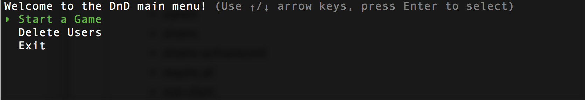
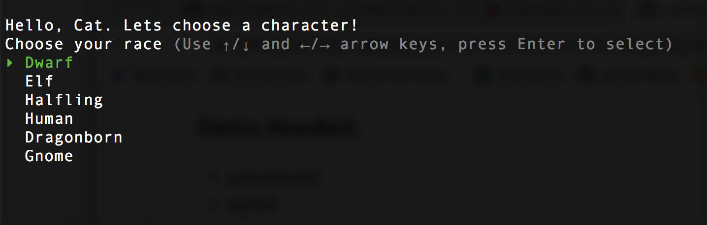
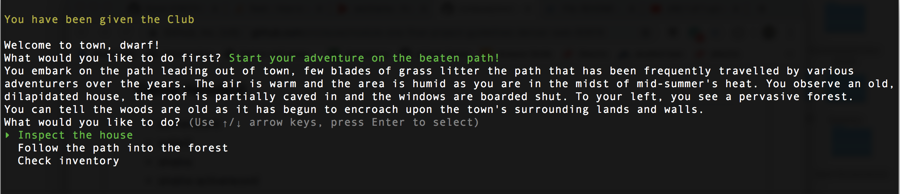
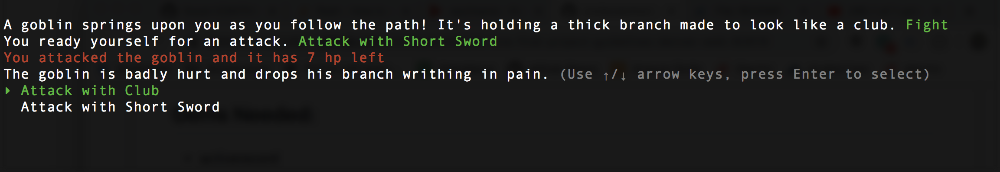

<!-- Make sure to create a good README.md with a short description, install instructions, a contributors guide and a link to the license for your code. --> 
# **DnD Adventure** 

Welcome to the DnD Adventure! This program will take you through a short, but fun, DnD adventure. You will be able to create a character with a race and class of your choice. Once you create your character, and are given your item, you will be able to begin your journey. Enjoy the option to explore and remember you _may_ run into monsters along the way!
 

## Gems Needed: 
- activerecord
- sqlite3
- sinatra
- sinatra-activerecord
- require_all
- rest-client
- TTY-Prompt
- TTY -Color
- colorize

## How to Install Gems: 
- In your terminal run:
 `bundle install` 

## Running the Program
1. In your terminal run the command `ruby runner.rb`
2. Use your arrow keys to navigate through the adventure 
3. Have fun!  
4. See a video of running through the program here: (https://youtu.be/PJTWHOh5P9U)

## Contributors 
This program was built by Andrew Thiessen and Catherine Clause. 
If you want to access this program feel free to clone from: (cnclause/module-one-final-project-guidelines-denver-web-82619).
The api used in this program can be found at:(http://www.dnd5eapi.co/).
